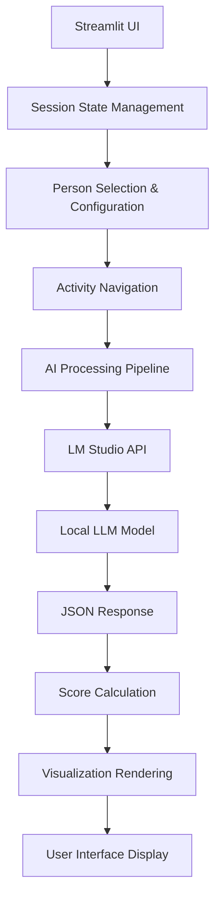

# ESCO Soft Skills Dashboard


An interactive **Streamlit dashboard** that leverages **local Large Language Models** (LLMs) to detect, analyze, and visualize soft skills in volunteer activity descriptions. Built with the **ESCO (European Skills, Competences, Qualifications and Occupations)** framework in mind, this tool helps match individuals to volunteer opportunities based on their soft skill profiles.

The application uses **LM Studio** for local AI inference, ensuring **privacy** and **no cloud dependencies** while providing intelligent soft skills analysis through natural language processing.

---

## 🎯 Project Overview and Purpose

### What is ESCO?
The **European Skills, Competences, Qualifications and Occupations (ESCO)** classification is the European multilingual classification of Skills, Competences, Qualifications and Occupations. This dashboard focuses on the **soft skills** (transversal skills) component of ESCO.

### Purpose
This dashboard serves multiple purposes:

- **🔍 Skills Analysis**: Automatically detect soft skills mentioned in volunteer activity descriptions
- **👥 Person Matching**: Match individuals to volunteer opportunities based on their skill profiles
- **📊 Visualization**: Interactive charts and scoring systems for skill alignment
- **🎯 Goal Alignment**: Consider personal goals and interests when making recommendations
- **🏆 Decision Support**: Provide detailed explanations and recommendations for volunteer matching

### Key Use Cases
- **Volunteer Organizations**: Match volunteers to activities that align with their skills
- **Career Development**: Identify skill gaps and development opportunities
- **Educational Planning**: Guide learning paths based on skill assessments
- **Research**: Analyze soft skill patterns in volunteer activities

---

## ✨ Features

### Core Functionality
- **🤖 Local AI Processing**: Uses LM Studio for private, offline LLM inference
- **📊 Interactive Dashboard**: Streamlit-based UI with real-time updates
- **🎯 Smart Matching**: AI-powered scoring system for person-activity alignment
- **📈 Visualization**: Dynamic charts and progress indicators
- **💡 Detailed Explanations**: AI-generated reasoning for all recommendations
- **🔧 Configurable Models**: Support for different LLM models via LM Studio

### Technical Features
- **🏗️ Modular Architecture**: Clean separation of UI, data processing, and AI client
- **⚡ Concurrent Processing**: Multi-threaded execution for responsive UI
- **🎨 Rich UI Components**: Tooltips, animations, and interactive elements
- **📝 Structured Data**: JSON-based AI responses with fallback handling
- **🔄 Auto-refresh**: Real-time updates during processing

### Privacy & Security
- **🔒 Local Processing**: All AI inference happens locally via LM Studio
- **🚫 No Cloud Dependencies**: No data sent to external services
- **📁 Local Data**: All volunteer activity data stored locally

---

## 🚀 Quick Start

### Prerequisites
Before you begin, ensure you have the following installed:

- **Python 3.11+** ([Download Python](https://www.python.org/downloads/))
- **LM Studio** Desktop Application ([Download LM Studio](https://lmstudio.ai/))
- **Git** (for cloning the repository)

### Step 1: Set Up LM Studio

1. **Download and Install LM Studio**
   - Visit [lmstudio.ai](https://lmstudio.ai/) and download the desktop app
   - Install and launch LM Studio

2. **Download the Required Model**
   - In LM Studio, search for and download: **`openai/gpt-oss-20b`**
   - This model provides good performance for soft skills analysis

3. **Start the Local Server**
   - In LM Studio, load the `openai/gpt-oss-20b` model
   - Click "Start Server" with default settings
   - Verify the server is running at: `http://localhost:1234/v1`

### Step 2: Clone and Set Up the Project

```bash
# Clone the repository
git clone https://github.com/RG-PEEC/esco_softskills_dashboard.git

# Navigate to the project directory
cd esco_softskills_dashboard

# Create a virtual environment
python -m venv .venv

# Activate the virtual environment
# On macOS/Linux:
source .venv/bin/activate

# On Windows (PowerShell):
# .venv\Scripts\Activate.ps1

# On Windows (Command Prompt):
# .venv\Scripts\activate.bat

# Upgrade pip and install dependencies
python -m pip install --upgrade pip
pip install -r requirements.txt
```

### Step 3: Run the Application

```bash
# Start the Streamlit dashboard
streamlit run app.py
```

The application will open in your default web browser at `http://localhost:8501`.

### Step 4: Using the Dashboard

1. **Select a Person**: Choose from 5 predefined person profiles (each with different skill sets)
2. **Customize Goals**: Set personal goals and interests for better matching
3. **Browse Activities**: Navigate through volunteer activities using the navigation controls
4. **View Analysis**: See real-time AI analysis with scores and explanations
5. **Interpret Results**: Review detailed reasoning and recommendations

---

## 📋 System Requirements

### Hardware Requirements
- **CPU**: Modern multi-core processor (Intel i5/AMD Ryzen 5 or better recommended)
- **RAM**: Minimum 8GB (16GB+ recommended for better LLM performance)
- **Storage**: 5GB free space (for model files and dependencies)
- **GPU**: Optional but recommended for faster inference (CUDA-compatible)

### Software Requirements

| Component | Version | Purpose |
|-----------|---------|---------|
| **Python** | 3.11+ | Main runtime environment |
| **LM Studio** | Latest | Local LLM serving |
| **Model** | `openai/gpt-oss-20b` | AI inference engine |

### Python Dependencies

Key packages (see `requirements.txt` for complete list):

```txt
streamlit>=1.49.1          # Web dashboard framework
pandas>=2.3.2              # Data manipulation
plotly>=6.3.0              # Interactive visualizations  
openai>=1.105.0            # LM Studio API client
requests>=2.32.5           # HTTP requests
streamlit-autorefresh      # Real-time updates
```

Install all dependencies with:
```bash
pip install -r requirements.txt
```

---

## ⚙️ Configuration

### Model Configuration

To change the AI model used for analysis, modify the model parameter in `functions.py`:

```python
# In functions.py, locate the LMStudioClient initialization
lm_studio_client = LMStudioClient(model="openai/gpt-oss-20b")  # Change model here
```

### Supported Models
- `openai/gpt-oss-20b` (default, recommended)
- Any model available in your LM Studio installation
- Models should support structured JSON output for best results

### Server Configuration

Default LM Studio settings:
```python
base_url = "http://localhost:1234/v1"
api_key = "lm-studio"  # Default LM Studio API key
```

To modify server settings, edit `lm_studio_client.py`.

---

## 💡 Usage Examples

### Example 1: Basic Person-Activity Matching

1. **Start the application** and navigate to the dashboard
2. **Select Person 1** (goal-oriented profile with planning skills)
3. **Navigate to Activity 5** (community garden project)
4. **Observe the matching score** and detailed AI explanation
5. **Review recommendations** in the expandable details section

### Example 2: Custom Goal Setting

1. **Choose any person** from the dropdown
2. **Update their goal** to: "I want to develop leadership skills"
3. **Set interests** to: "Environment, Community Building"
4. **Browse activities** to see how scores change based on goals
5. **Compare scores** across different activities

### Example 3: Skill Gap Analysis

1. **Select Person 2** (detail-oriented, compliance-focused)
2. **Find activities** with low matching scores
3. **Read AI explanations** to identify missing skills
4. **Use insights** for skill development planning

---

## 🏗️ Project Structure

```
esco_softskills_dashboard/
│
├── 📄 README.md                  # This comprehensive documentation
├── 📄 LICENSE                    # GPL-3.0 license file
├── 📄 requirements.txt           # Python dependencies
├── 📄 .gitignore                 # Git ignore rules
│
├── 🚀 app.py                     # Main Streamlit application
├── 🔧 functions.py               # UI helpers, highlighting, AI processing
├── 🌐 lm_studio_client.py        # HTTP client for LM Studio API
├── 📊 data.py                    # Demo data and person profiles
│
└── 📁 data/                      # Data directory
    └── volunteer_activities_*.csv # Volunteer activity datasets (66 activities)
```

### File Descriptions

| File | Purpose | Key Functions |
|------|---------|---------------|
| **`app.py`** | Main application entry point | UI orchestration, session state management, rendering |
| **`functions.py`** | Core business logic | AI prompt building, response parsing, HTML highlighting |
| **`lm_studio_client.py`** | API communication | OpenAI-compatible client for LM Studio |
| **`data.py`** | Data management | CSV loading, person profiles, skill definitions |

### Key Components

#### Person Profiles
The application includes 5 predefined person profiles, each with different skill sets:

- **Person 1**: Leadership and responsibility-focused
- **Person 2**: Detail-oriented and compliance-focused  
- **Person 3**: Creative and entrepreneurial
- **Person 4**: Empathetic and socially-oriented
- **Person 5**: Health and science-oriented

#### Activity Dataset
- **66 volunteer activities** with detailed descriptions
- **ESCO skill predictions** for each activity
- **Structured data** in CSV format for analysis

---

## 🔧 How It Works

### Architecture Overview



### Processing Pipeline

1. **Input Processing**
   - User selects person profile and activity
   - System loads person skills, goals, and interests
   - Activity description is retrieved from dataset

2. **AI Analysis**
   - Structured prompt is built with context
   - Request sent to local LM Studio API
   - LLM analyzes skill alignment and provides scoring

3. **Response Processing**  
   - JSON response parsed and validated
   - Score clamped to 0.0-1.0 range
   - Fallback handling for invalid responses

4. **Visualization**
   - Real-time progress indicators during processing
   - Interactive charts with animations
   - Detailed explanations with markdown formatting

### Concurrency Model

The application uses Python's `concurrent.futures` for non-blocking AI processing:

- **ThreadPoolExecutor** manages AI requests
- **Session state** tracks ongoing futures  
- **Auto-refresh** updates UI during processing
- **Graceful handling** of concurrent requests

---

## 📖 Usage Notes

### Performance Tips
- **Keep LM Studio running** with the server active while using the dashboard
- **Pre-load the model** in LM Studio before starting the Streamlit app for faster responses
- **Use GPU acceleration** if available for significantly better performance
- **Expect 5-15 second response times** for AI analysis (varies by hardware)

### Best Practices
- **Allow processing to complete** before switching activities (concurrent requests are handled)
- **Review detailed explanations** for insights into AI reasoning
- **Experiment with different person profiles** to understand skill matching
- **Customize goals and interests** for more personalized recommendations

### Data Considerations
- The application uses **demo data** with 66 volunteer activities
- **Person profiles are predefined** but goals/interests can be customized
- **ESCO skill framework** provides the foundation for analysis
- **Results are AI-generated** and should be interpreted as suggestions, not definitive assessments

---

## Troubleshooting

### Common Issues and Solutions

#### LM Studio Connection Issues

**❌ "The app cannot reach LM Studio"**

**Solution:**
- Confirm LM Studio server is running (click "Start Server" in LM Studio)
- Verify the URL matches `http://localhost:1234/v1` (default)
- Check for firewall blocking port 1234
- Ensure no other applications are using port 1234
- Try restarting LM Studio if connection fails

#### Model Issues

**❌ "Model not loaded or wrong name"**

**Solution:**
- In LM Studio, ensure `openai/gpt-oss-20b` is selected and loaded
- Verify the exact model name matches in your configuration
- Download the model if not present in LM Studio
- Check model compatibility with your system resources

#### Python Environment Issues

**❌ `ModuleNotFoundError` or package errors**

**Solution:**
```bash
# Ensure virtual environment is activated
source .venv/bin/activate  # macOS/Linux
# or
.venv\Scripts\Activate.ps1  # Windows PowerShell

# Reinstall dependencies
pip install --upgrade pip
pip install -r requirements.txt
```

#### Streamlit Issues

**❌ "Streamlit does not open browser tab"**

**Solution:**
- Manually navigate to `http://localhost:8501` in your browser
- Check if port 8501 is available
- Try specifying a different port: `streamlit run app.py --server.port 8502`

**❌ "Application appears frozen or unresponsive"**

**Solution:**
- Wait for AI processing to complete (can take 5-15 seconds)
- Check LM Studio is responding
- Restart the Streamlit application if needed
- Clear browser cache and refresh

### Debug Mode

For additional debugging information, run Streamlit in debug mode:

```bash
streamlit run app.py --logger.level debug
```

### Performance Issues

**🐌 Slow AI responses**

**Solutions:**
- Use GPU acceleration in LM Studio if available
- Try a smaller/faster model if performance is critical
- Ensure adequate RAM is available (16GB+ recommended)
- Close other resource-intensive applications

---

## 🤝 Contributing

We welcome contributions to the ESCO Soft Skills Dashboard! Here's how you can help improve the project:

### Ways to Contribute

- 🐛 **Bug Reports**: Found an issue? Please report it!
- 💡 **Feature Requests**: Have an idea? We'd love to hear it!
- 📖 **Documentation**: Help improve our documentation
- 🔧 **Code Contributions**: Submit pull requests for fixes or features
- 🧪 **Testing**: Help test on different platforms

### Development Setup

1. **Fork the repository** on GitHub
2. **Clone your fork** locally:
   ```bash
   git clone https://github.com/YOUR_USERNAME/esco_softskills_dashboard.git
   cd esco_softskills_dashboard
   ```

3. **Create a development environment**:
   ```bash
   python -m venv .venv
   source .venv/bin/activate  # macOS/Linux
   pip install -r requirements.txt
   ```

4. **Create a feature branch**:
   ```bash
   git checkout -b feature/your-feature-name
   ```

5. **Make your changes** following our guidelines below

6. **Test your changes** thoroughly

7. **Submit a pull request** with a clear description

### Development Guidelines

#### Code Style
- **Python**: Follow PEP 8 guidelines
- **Comments**: Add comments for complex logic
- **Functions**: Keep functions focused and well-documented
- **Imports**: Organize imports (standard library, third-party, local)

#### Architecture Principles
- **Separation of Concerns**: Keep UI logic in `app.py`, business logic in `functions.py`
- **Modularity**: Make components reusable and testable  
- **Configuration**: Use environment variables over hard-coded values
- **Error Handling**: Implement graceful fallbacks for AI failures

#### Testing
- Test on multiple platforms if possible (Windows, macOS, Linux)
- Verify LM Studio integration works correctly
- Test with different models when possible
- Check edge cases and error scenarios

### Pull Request Process

1. **Update documentation** if you've made significant changes
2. **Add tests** for new functionality (if testing framework exists)
3. **Update README.md** if you've added features or changed setup
4. **Ensure clean commit history** with descriptive messages
5. **Reference issue numbers** in commit messages when applicable

### Issue Reporting

When reporting issues, please include:

- **Environment details**: OS, Python version, LM Studio version
- **Error messages**: Full stack traces when applicable
- **Steps to reproduce**: Clear instructions to recreate the issue
- **Expected vs actual behavior**: What should happen vs what happens
- **Screenshots**: For UI issues, include screenshots

---

## 🌐 Platform Support

### Supported Platforms

| Platform | Status | Notes |
|----------|---------|-------|
| **macOS** | ✅ Fully Tested | Primary development platform |
| **Linux** | ⚠️ Expected to Work | Not extensively tested |
| **Windows** | ⚠️ Expected to Work | Not extensively tested |

### Platform-Specific Notes

#### macOS
- **Developed and tested** on macOS
- **M1/M2 Macs**: LM Studio supports Apple Silicon
- **Intel Macs**: Full compatibility expected

#### Linux
- **Dependencies**: Ensure all system dependencies are installed
- **LM Studio**: Available for Linux
- **Virtual environments**: Use system Python or pyenv for best results

#### Windows  
- **PowerShell**: Recommended terminal for setup commands
- **LM Studio**: Windows version available
- **Path issues**: Use forward slashes in paths when possible

### Help Wanted: Platform Testing

We're looking for contributors to help test and verify functionality on:
- Various Linux distributions (Ubuntu, Fedora, Arch, etc.)
- Windows 10/11 systems
- Different Python versions (3.11, 3.12)

If you successfully run the application on these platforms, please let us know!

---

## 📄 License

This project is licensed under the **GNU General Public License v3.0 (GPL-3.0)**.

### What this means:
- ✅ **Use**: You can use this software for any purpose
- ✅ **Modify**: You can modify the source code
- ✅ **Distribute**: You can distribute original or modified versions
- ✅ **Private Use**: You can use this privately
- ⚠️ **Share Alike**: If you distribute modified versions, they must also be GPL-3.0
- ⚠️ **Source Available**: You must provide source code when distributing

See the [LICENSE](LICENSE) file for the complete license text.

### Third-Party Licenses

This project uses several open-source libraries. Key dependencies:
- **Streamlit**: Apache License 2.0
- **OpenAI Python Library**: Apache License 2.0
- **Pandas**: BSD-3-Clause License
- **Plotly**: MIT License

See `requirements.txt` and individual package documentation for complete licensing information.

---

## 👥 Contact & Maintainers

### Project Maintainers

This project is maintained by the **RG-PEEC** team. For questions, issues, or collaboration:

- **GitHub Repository**: [RG-PEEC/esco_softskills_dashboard](https://github.com/RG-PEEC/esco_softskills_dashboard)
- **Issues & Bug Reports**: [GitHub Issues](https://github.com/RG-PEEC/esco_softskills_dashboard/issues)
- **Feature Requests**: [GitHub Discussions](https://github.com/RG-PEEC/esco_softskills_dashboard/discussions) (if available)

### Getting Help

1. **Documentation**: Start with this README and inline code comments
2. **Search Issues**: Check if your question has been asked before
3. **Create an Issue**: For bugs, feature requests, or questions
4. **Community**: Engage with other users and contributors

### Research & Academic Use

This project relates to **ESCO (European Skills, Competences, Qualifications and Occupations)** framework research. If you use this software in academic work, please consider:

- **Citing the repository** in your publications
- **Sharing your findings** with the community
- **Contributing improvements** back to the project

---

## 🙏 Acknowledgments

### Core Technologies
- **[LM Studio](https://lmstudio.ai/)** - For providing an excellent local LLM serving platform
- **[Streamlit](https://streamlit.io/)** - For the powerful web application framework
- **[OpenAI](https://openai.com/)** - For the compatible API standard

### AI Models
- **OpenAI GPT OSS 20B** - For the default language model capabilities
- **Open source model contributors** - For making high-quality models available

### Frameworks & Standards
- **[ESCO](https://ec.europa.eu/esco/)** - European Skills, Competences, Qualifications and Occupations classification
- **European Commission** - For supporting skills standardization efforts

### Development Tools
- **Python Community** - For the excellent ecosystem of libraries
- **Plotly** - For beautiful interactive visualizations
- **GitHub** - For hosting and collaboration tools

### Special Thanks
- **Contributors** - To all who have contributed code, documentation, or feedback
- **Testers** - To those who help verify functionality across platforms
- **Users** - To everyone using this tool for skills analysis and matching

---

*Made with ❤️ for the ESCO skills analysis community*
